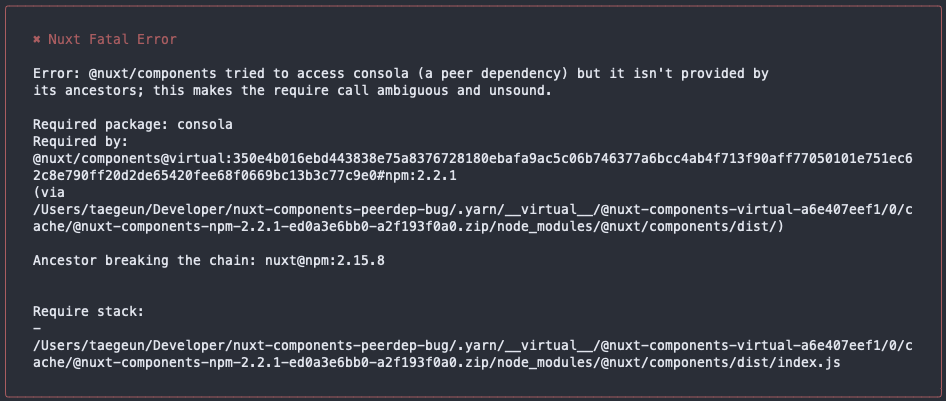

# Summary
- Nuxt.js 2.15.8 fails to build and dev when used with yarn berry [Plug and Play](https://yarnpkg.com/features/pnp).
    - nuxt@2.15.8
        - @nuxt/components@^2.2.1
            - consola@latest
            - **(peerDependency) consola**
        - ~~(missing) consola~~

- `@nuxt/components` expects its ancestor to have `consola` as a dependency.
    - `nuxt`, an ancestor of`@nuxt/components` doesn't have `consola` as a dependency.

Depending on the package manager you are using, this might or might not cause a failure.
- Some report this as an error, while others report this as a warning (which is a case of yarn pnp mode)

# Reproduction

```shell
$ git clone https://github.com/LunaTK/nuxt-components-peerdep-bug
$ yarn install
$ yarn build
```

See the error

